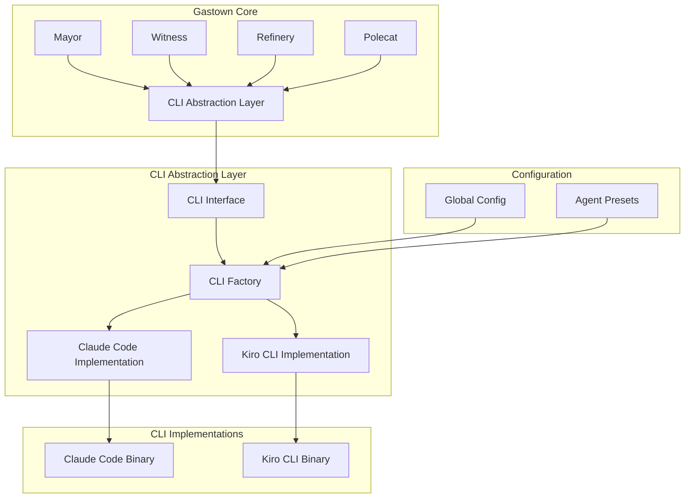

# Detailed Design - Gastown Kiro CLI Compatibility

## Overview

This design enables Gastown to work with both Claude Code and Kiro CLI through a pluggable abstraction layer. Users can configure their preferred AI CLI globally, and all Gastown features work identically regardless of the underlying CLI.

## Detailed Requirements

### Functional Requirements
1. **Full CLI Replacement**: Users choose either Claude Code OR Kiro CLI as their AI assistant
2. **Global Configuration**: Single configuration setting applies to all projects and agents
3. **Feature Parity**: All Gastown features work identically with both CLIs
4. **Backwards Compatibility**: Existing Claude Code setups continue working unchanged
5. **Identical Workflows**: Convoys, beads, formulas, molecules work the same way
6. **Error Handling Consistency**: Same error handling approach for both CLIs

### Non-Functional Requirements
1. **High Priority**: Significant effort allocation for rapid implementation
2. **Performance Parity**: Similar performance between CLIs (minor differences acceptable)
3. **Parallel Testing**: Same workflows tested with both CLIs for verification

## Architecture Overview



## Components and Interfaces

### 1. CLI Interface

```go
// CLI defines the interface all AI CLIs must implement
type CLI interface {
    // Command building
    BuildStartupCommand(role, actor, rigPath, prompt string) string
    BuildResumeCommand(sessionID string) string
    
    // Configuration management
    CreateConfiguration(workDir string, roleType RoleType) error
    
    // Session management
    IsProcessRunning(sessionName string) bool
    GetSessionIDEnvVar() string
    SupportsSessionResume() bool
    
    // Process monitoring
    GetProcessNames() []string
    
    // Feature support
    SupportsHooks() bool
    SupportsForkSession() bool
}
```

### 2. CLI Factory

```go
type CLIFactory struct {
    registry map[string]func() CLI
}

func (f *CLIFactory) CreateCLI(cliType string) (CLI, error) {
    constructor, exists := f.registry[cliType]
    if !exists {
        return nil, fmt.Errorf("unsupported CLI type: %s", cliType)
    }
    return constructor(), nil
}
```

### 3. Claude Code Implementation

```go
type ClaudeCodeCLI struct {
    command string
    args    []string
}

func (c *ClaudeCodeCLI) BuildStartupCommand(role, actor, rigPath, prompt string) string {
    envVars := map[string]string{
        "GT_ROLE":         role,
        "BD_ACTOR":        actor,
        "GIT_AUTHOR_NAME": actor,
    }
    
    var exports []string
    for k, v := range envVars {
        exports = append(exports, fmt.Sprintf("%s=%s", k, v))
    }
    
    cmd := "export " + strings.Join(exports, " ") + " && claude --dangerously-skip-permissions"
    if prompt != "" {
        cmd += " " + shellescape.Quote(prompt)
    }
    return cmd
}

func (c *ClaudeCodeCLI) CreateConfiguration(workDir string, roleType RoleType) error {
    return claude.EnsureSettings(workDir, roleType)
}
```

### 4. Kiro CLI Implementation

```go
type KiroCLI struct {
    command string
}

func (k *KiroCLI) BuildStartupCommand(role, actor, rigPath, prompt string) string {
    envVars := map[string]string{
        "GT_ROLE":         role,
        "BD_ACTOR":        actor,
        "GIT_AUTHOR_NAME": actor,
    }
    
    var exports []string
    for k, v := range envVars {
        exports = append(exports, fmt.Sprintf("%s=%s", k, v))
    }
    
    cmd := "export " + strings.Join(exports, " ") + " && kiro-cli chat"
    if prompt != "" {
        cmd += " " + shellescape.Quote(prompt)
    }
    return cmd
}

func (k *KiroCLI) CreateConfiguration(workDir string, roleType RoleType) error {
    return k.createKiroAgentConfig(workDir, roleType)
}
```

## Data Models

### CLI Configuration

```go
type CLIConfig struct {
    Type     string `json:"type"`     // "claude" or "kiro"
    Version  int    `json:"version"`
    Settings map[string]interface{} `json:"settings,omitempty"`
}
```

### Agent Preset Extension

```go
type AgentPresetInfo struct {
    // Existing fields...
    Name         AgentPreset `json:"name"`
    Command      string      `json:"command"`
    Args         []string    `json:"args"`
    
    // New CLI-specific fields
    CLIType      string      `json:"cli_type"`      // "claude" or "kiro"
    ConfigType   string      `json:"config_type"`   // "hooks" or "agent"
}
```

## Error Handling

### Error Abstraction

```go
type CLIError struct {
    CLI     string
    Command string
    Err     error
}

func (e *CLIError) Error() string {
    return fmt.Sprintf("CLI %s command failed: %s: %v", e.CLI, e.Command, e.Err)
}
```

### Error Handling Strategy
1. **Normalize Errors**: Convert CLI-specific errors to common `CLIError` type
2. **Preserve Context**: Include CLI type and command context in errors
3. **Consistent Logging**: Use same logging format regardless of CLI
4. **Graceful Degradation**: Handle missing features gracefully

## Testing Strategy

### Parallel Testing Framework

```go
type CLITestSuite struct {
    claudeCLI CLI
    kiroCLI   CLI
}

func (s *CLITestSuite) TestWorkflow(t *testing.T, workflow WorkflowFunc) {
    t.Run("Claude", func(t *testing.T) {
        workflow(t, s.claudeCLI)
    })
    
    t.Run("Kiro", func(t *testing.T) {
        workflow(t, s.kiroCLI)
    })
}
```

### Test Coverage
1. **Command Building**: Verify correct command generation for both CLIs
2. **Session Management**: Test session creation, resume, and monitoring
3. **Configuration**: Verify proper config file generation
4. **Process Monitoring**: Test health checks and process detection
5. **Error Scenarios**: Test timeout, crash, and recovery scenarios

## Appendices

### Technology Choices

**Abstraction Pattern**: Interface-based abstraction with factory pattern
- **Pros**: Clean separation, easy to extend, testable
- **Cons**: Additional complexity layer

**Configuration Approach**: Global CLI type setting with CLI-specific configurations
- **Pros**: Simple user experience, backwards compatible
- **Cons**: Cannot mix CLIs in same workspace

### Research Findings Summary

**Claude Code Integration Points**:
- Agent preset system with built-in CLI configurations
- Command building with environment variable setup
- Hook system integration via `.claude/settings.json`
- Session management with `CLAUDE_SESSION_ID`
- Process monitoring for health checks

**Kiro CLI Characteristics**:
- Subcommand structure (`kiro-cli chat`)
- Agent-based configuration system
- Tool permission model
- Automatic session persistence
- Settings via command-line interface

### Alternative Approaches Considered

**Per-Project Configuration**: Rejected due to complexity and user confusion
**Runtime Selection**: Rejected due to session management complications
**Hybrid Support**: Rejected due to increased complexity without clear benefit

### Key Constraints and Limitations

**Session Model Differences**: 
- Claude Code uses manual session IDs
- Kiro CLI uses automatic persistence
- Solution: Abstract session management in Gastown layer

**Permission Model Differences**:
- Claude Code uses global permission flags
- Kiro CLI uses granular tool permissions  
- Solution: Generate appropriate configurations for each CLI

**Configuration Format Differences**:
- Claude Code uses JSON configuration files
- Kiro CLI uses command-line settings and agent configs
- Solution: CLI-specific configuration generators
